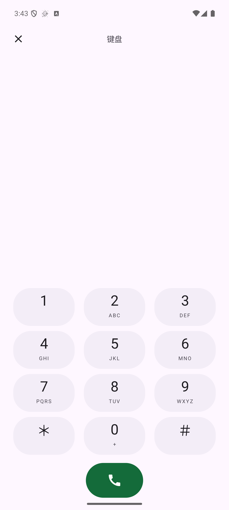
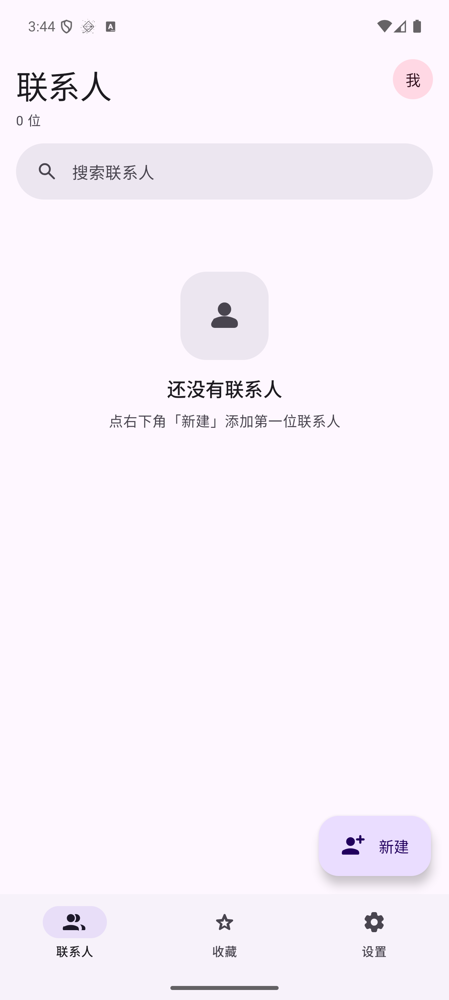

# Evelorion 私密通讯录与电话

本仓库包含两个 Android App 和一个端到端加密同步后端：

- `contacts-app`：私密联系人管理与加密同步
- `phone-app`：电话、通话记录与录音入口
- `server`：TypeScript / Fastify / SQLite 同步服务

服务器只保存加密后的联系人和通话记录。Android APK 必须在本机构建，
签名证书、签名口令、真实云端地址和 `.env` 均不进入 Git。

## 应用预览

### 电话 App



### 通讯录 App



## 文档

- [项目说明](说明.md)
- [开发指南](开发指南.md)
- [云端部署](docs/DEPLOYMENT.md)
- [架构说明](docs/ARCHITECTURE.md)
- [API](docs/API.md)
- [安全设计](docs/DESIGN.md)

## 后端验证

```bash
cd server
npm install
npm run build
npm run test:e2e
npm run test:web
```

## Android 构建

使用 JDK 17 和 Android SDK 36，在本机分别打开 `contacts-app` 与 `phone-app`。
两个 App 必须使用同一份本地签名证书，并通过环境变量提供：

```text
KEYSTORE_PASSWORD
KEY_ALIAS
KEY_PASSWORD
```

签名材料只保存在本机离线备份中。
